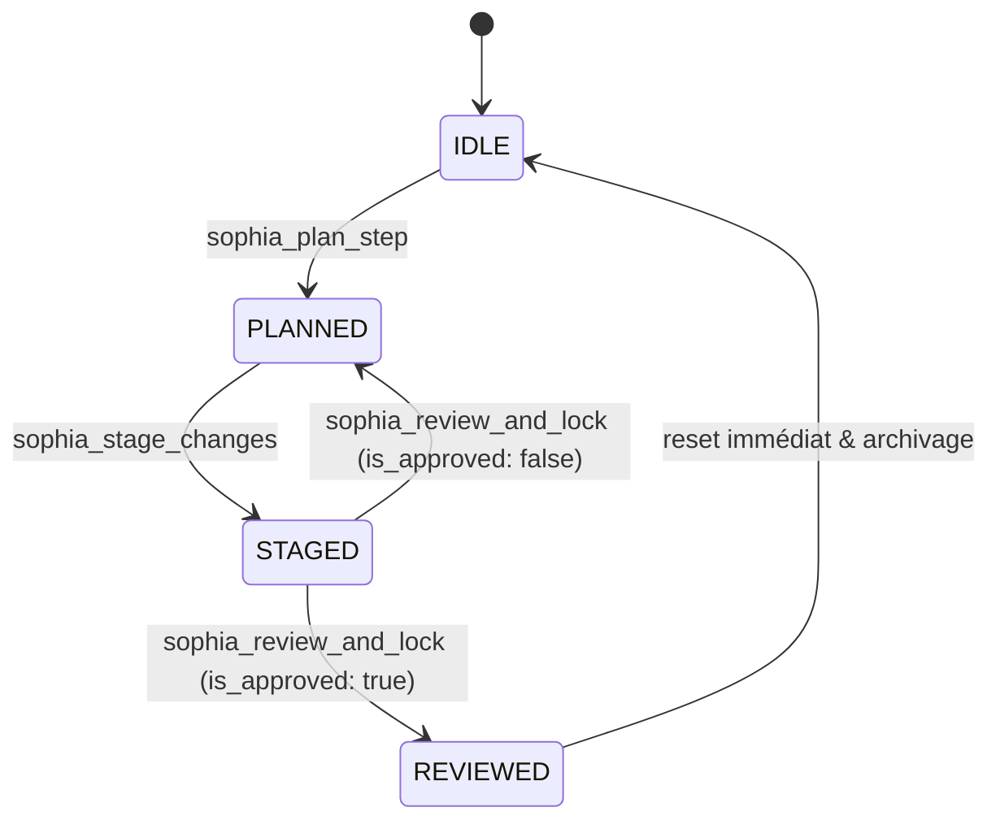

# MCP Server Sophia (`mcp-server-sophia`)

**Sophia** est un serveur MCP (Model Context Protocol) servant de garde-fou (*gatekeeper*) strict pour les assistants IA de développement.

Il impose une Machine à États Finis (FSM) pour interdire toute modification non réfléchie ou non revue :


---

## Invariants et Outils

| Étape | Outil MCP | Arguments | Effet sur l'état |
|---|---|---|---|
| **1. Planification** | `sophia_plan_step` | `step_name: string`, `reasoning: string` | `IDLE` ➔ `PLANNED` |
| **2. Isolation** | `sophia_stage_changes` | `target_file: string`, `diff_or_code: string` | `PLANNED` ➔ `STAGED` |
| **3. Auto-review** | `sophia_review_and_lock` | `review_notes: string`, `is_approved: boolean` | `STAGED` ➔ `REVIEWED` ➔ `IDLE` (si approuvé)<br>`STAGED` ➔ `PLANNED` (si rejeté) |
| **Idempotent** | `sophia_status` | *(aucun)* | Lecture de l'état actuel et de l'historique de session |

Toute tentative d'appel d'un outil hors de sa séquence légitime lève une erreur explicite avec le flag `{ isError: true }` conforme au protocole MCP.

---

## Installation et Compilation

```bash
# Installation des dépendances
npm install

# Compilation TypeScript
npm run build

# Exécution des tests unitaires
npm test
```

---

## Configuration Client

### 1. Usage Local (Stdio)

Dans votre client local (Claude Desktop, Cursor, etc.) :

```json
{
  "mcpServers": {
    "sophia": {
      "command": "node",
      "args": [
        "/Users/vincentbullion/Documents/GitHub/sophia/dist/index.js"
      ]
    }
  }
}
```

### 2. Usage Distant / Cloud (SSE sur Render)

Une fois déployé sur Render (ou en Docker avec `PORT=10000`) :
```json
{
  "mcpServers": {
    "sophia": {
      "url": "https://votre-app-sophia.onrender.com/sse"
    }
  }
}
```

---

## Déploiement Cloud (Render & Docker)

Le serveur supporte automatiquement le mode double :
- **Stdio :** activé par défaut en local.
- **HTTP / SSE :** activé automatiquement dès que la variable d'environnement `PORT` est présente (comme sur Render).

### Déploiement Render en 1 clic :
1. Créez un compte sur [Render.com](https://render.com).
2. Cliquez sur **New > Blueprint** et connectez ce repository GitHub.
3. Le fichier [`render.yaml`](file:///Users/vincentbullion/Documents/GitHub/sophia/render.yaml) configure automatiquement le service Web Docker, le port `10000` et la vérification de santé sur `/health`.

---

## Intégration Continue (CI / GitHub Actions)

Le workflow [`.github/workflows/ci.yml`](file:///Users/vincentbullion/Documents/GitHub/sophia/.github/workflows/ci.yml) est déjà configuré :
- Se déclenche automatiquement sur `push` et `pull_request` vers `main`.
- Valide la compilation TypeScript sur Node 20 & 22.
- Exécute les tests unitaires et invariants FSM.
- Vérifie la construction du conteneur Docker.

